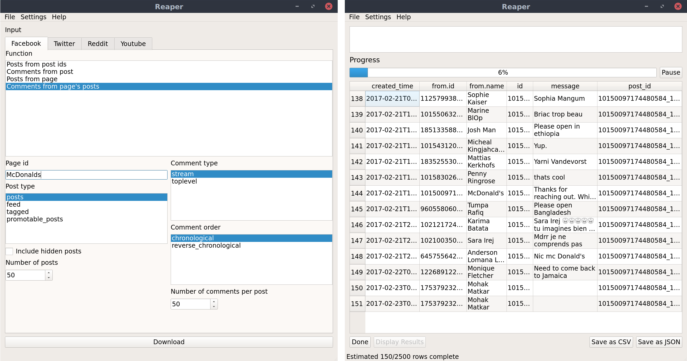

# Reaper

[Documentation](https://reaper.readthedocs.io)

Reaper is a PyQt5 GUI that scrapes Facebook, Twitter, Reddit and Youtube apis 
using the `socialreaper` [package](https://github.com/ScriptSmith/socialreaper).

## [Download](https://github.com/ScriptSmith/reaper/releases)
To download the latest builds for your platform, check out the [releases](https://github.com/ScriptSmith/reaper/releases)

## Usage
To use Reaper, install `socialreaper` and `PyQt5`, then run `reaper.py`
